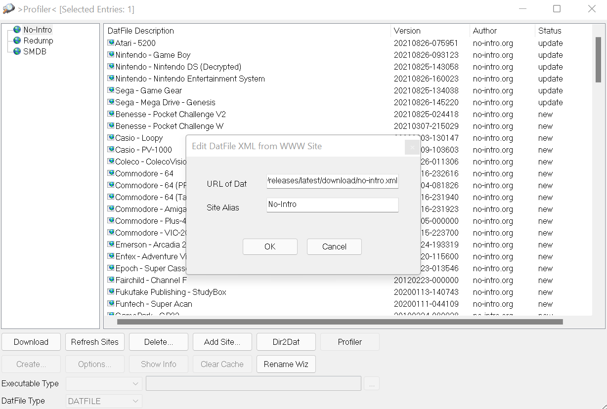

# Auto DAT file generator

WWW profiles to use in clrmamepro for the standard No-Intro and Redump sets.

Refreshes once every 24h automatically.

## URLs

### No-Intro

`https://github.com/hugo19941994/auto-datfile-generator/releases/latest/download/no-intro.xml`

### No-Intro (parent-clone)

`https://github.com/hugo19941994/auto-datfile-generator/releases/latest/download/no-intro_parent-clone.xml`

### Redump

`https://github.com/hugo19941994/auto-datfile-generator/releases/latest/download/redump.xml`

<!-- disabled for CI failures -->
<!-- ### Hardware Target Game Database

`https://github.com/hugo19941994/auto-datfile-generator/releases/latest/download/smdb.xml` -->

<!-- disabled for CI failures -->
<!-- ### Custom dats.site

`https://github.com/hugo19941994/auto-datfile-generator/releases/latest/download/dats-site.xml` -->

Project inspired by [redump-xml-updater](https://github.com/bilakispa/redump-xml-updater)

## Header support

Some No-Intro dats require an extra XML file to detect headers.

Download the following zips, extract them and place the XML files in clrmamepro's `headers` folder:

- [Atari Jaguar](https://datomatic.no-intro.org/stuff/header_a7800.zip)
- [Atari Lynx](https://datomatic.no-intro.org/stuff/header_lynx.zip)
- [Nintendo FDS](https://datomatic.no-intro.org/stuff/header_fds.zip)
- [Nintendo NES](https://datomatic.no-intro.org/stuff/header_nes.zip)
